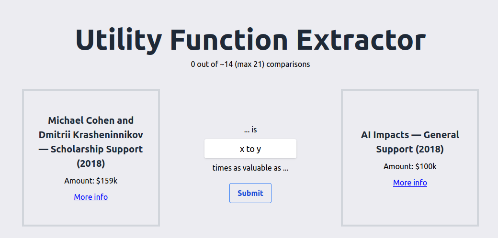
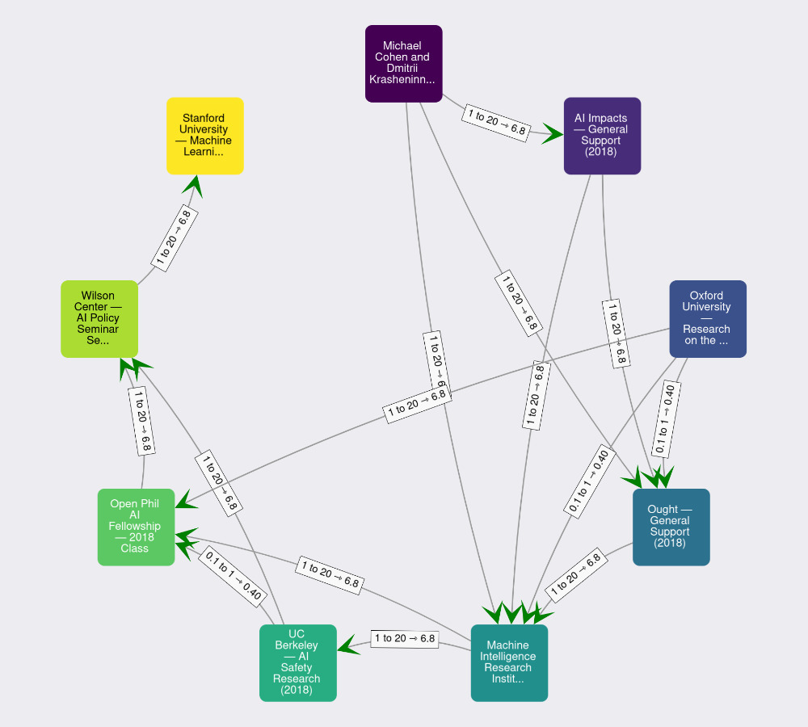
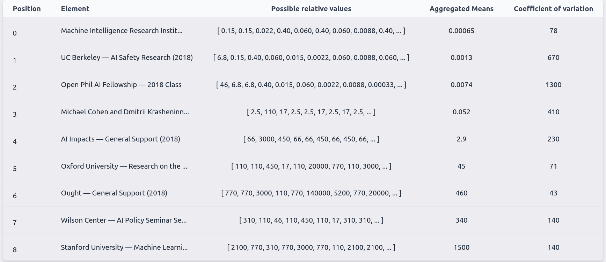

## About

This repository creates a react webpage that allows to extract a utility function from possibly inconsistent binary comparisons.

It presents the users with a series of elements to compare, using merge-sort in the background to cleverly minimize the number of choices needed.

<p align="center">
  
</p>

Then, it cleverly aggregates them, on the one hand by producing a graphical representation:

<p align="center">
  
</p>

and on the other hand doing some fast and clever mean aggregation [^1]:

<p align="center">
  
</p>

Initially, users could only input numbers, e.g., "A is `3` times better than B". But now, users can also input distributions, using the [squiggle](https://www.squiggle-language.com/) syntax, e.g., "A is `1 to 10` times better than B", or "A is `mm(normal(1, 10), uniform(0,100))` better than B".

**If you want to use the utility function extractor for a project, we are happy to add a page for your project, like `utility-function-extractor.quantifieduncertainty.org/your-project`**.

## Built with

- [Nextjs](https://nextjs.org/)
- [Netlify](https://github.com/netlify/netlify-plugin-nextjs/#readme)
- [React](https://reactjs.org/)
- [Squiggle](https://www.squiggle-language.com/)
- [Utility tools](https://github.com/quantified-uncertainty/utility-function-extractor/tree/master/packages/utility-tools)

## Usage

Navigate to [utility-function-extractor.quantifieduncertainty.org/](https://utility-function-extractor.quantifieduncertainty.org/), and start comparing objects.

You can change the list of objects to be compared by clicking on "advanced options".

After comparing objects for a while, you will get a table and a graph with results. You can also use the [utility tools](https://github.com/quantified-uncertainty/utility-function-extractor/tree/master/packages/utility-tools) package to process these results, for which you will need the json of comparisons, which can be found in "Advanced options" -> "Load comparisons"

## Notes

The core structure is json array of objects. Only the "name" attribute is required. If there is a "url", it is displayed nicely.

```
[
    {
        "name": "Peter Parker",
        "someOptionalKey": "...",
        "anotherMoreOptionalKey": "...",
    },
    {
        "name": "Spiderman",
        "someOptionalKey": "...",
        "anotherMoreOptionalKey": "..."
    }
]
```

The core structure for links is as follows:

```
[
    {
        "source": "Peter Parker",
        "target": "Spiderman",
        "squiggleString": "1 to 100",
        "distance": 26.639800977355474
    },
    {
        "source": "Spiderman",
        "target": "Jonah Jameson",
        "squiggleString": "20 to 2000",
        "distance": 6.76997149080232
    },

]
```

A previous version of this webpage had a more complicated structure, but it has since been simplified.

## Contributions and help

We welcome PR requests.

## License

Distributed under the MIT License. See LICENSE.txt for more information.

## To do

- [x] Extract merge, findPath and aggregatePath functionality into different repos
- [x] Send to mongo upon completion
- [x] Push to github
- [x] Push to netlify
- [x] Don't allow further comparisons after completion
- [x] Paths table
  - [x] Add paths table
  - [x] warn that the paths table is approximate.
  - I really don't feel like re-adding this after having worked out the distribution rather than the mean aggregation
  - On the other hand, I think it does make it more user to other users.
- [x] Change README.
- [ ] Add functionality like names, etc.
  - I also don't feel like doing this
- [ ] Look back at Amazon thing which has been running
- [ ] Simplify Graph and DynamicSquiggleChart components
- [ ] Add squiggle component to initial comparison?

[^1]: The program takes each element as a reference point in turn, and computing the possible distances from that reference point to all other points, and taking the geometric mean of these distances. This produces a number representing the value of each element, such that the ratios between elements represent the user's preferences: a utility function. However, this isn't perfect; the principled approach woud be to aggregate the distributions rather than their means. But this principled approach is much more slowly. For the principled approach, see the `utility-tools` repository.
